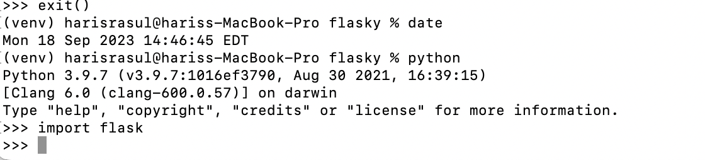
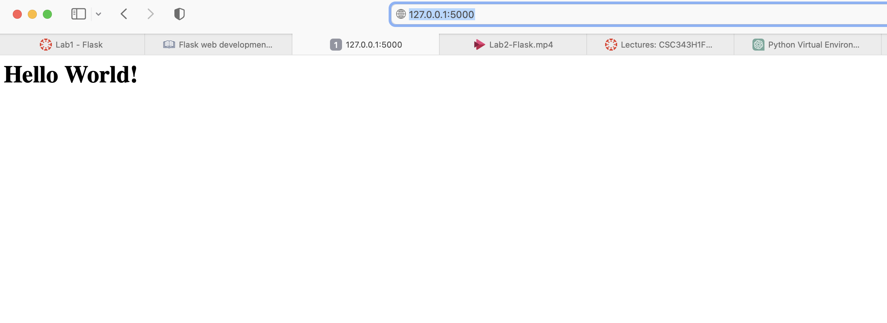
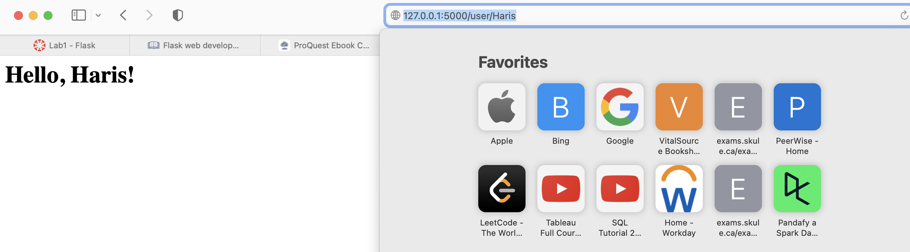
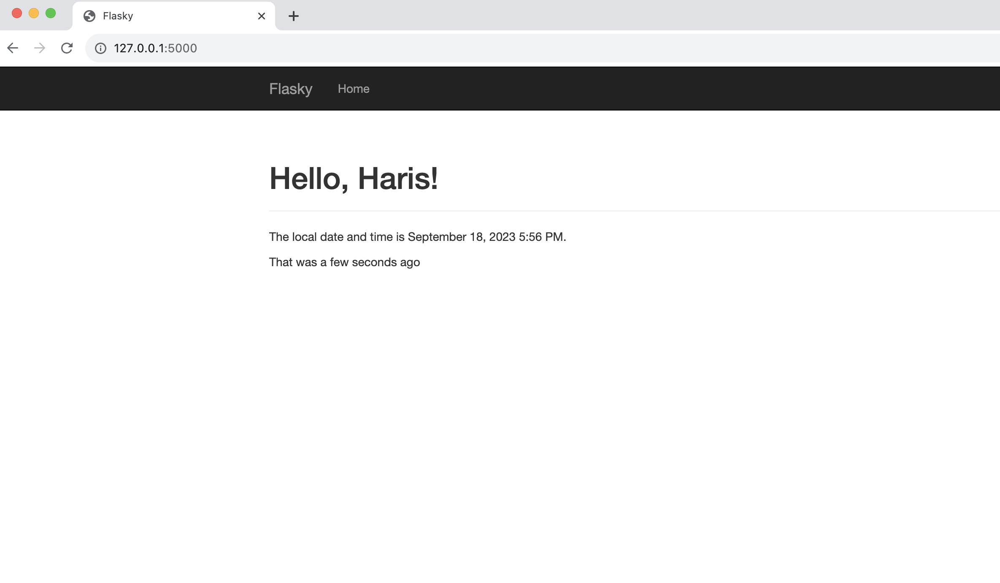

# ECE444-F2023-Lab1

Made by Haris Rasul, Sept 18th 2023

this repo is a clone of https://github.com/miguelgrinberg/flasky

# Activity 1 - Install Flask

# Activity 2 - Examples in section 2

# Activity 3 - Example in Section 3

