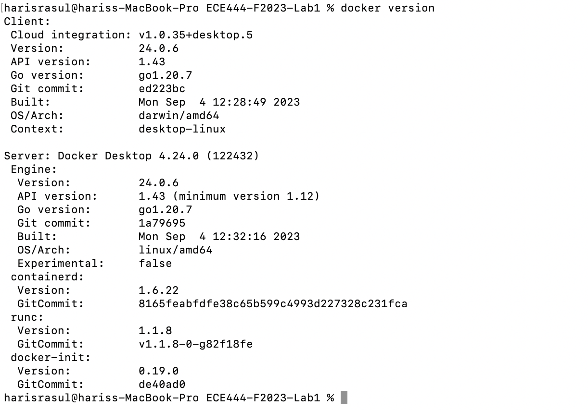
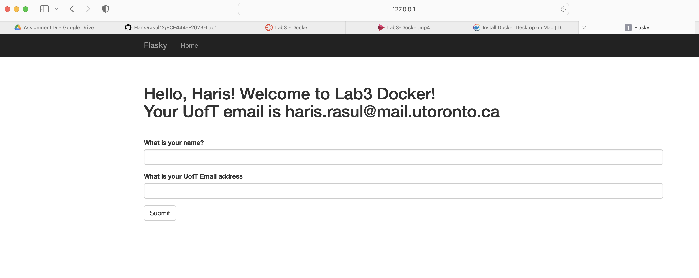
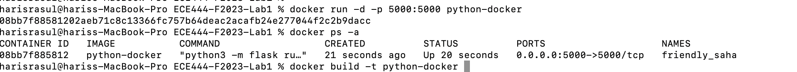
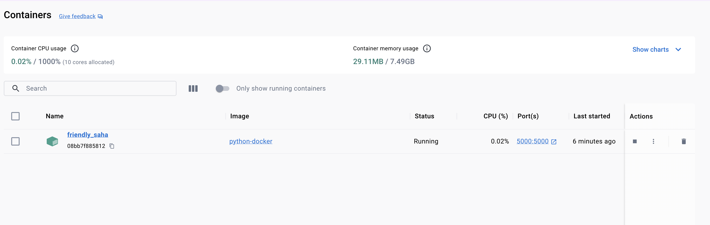

# ECE444-F2023-Lab3

Made by Haris Rasul, Oct 2nd 2023

this repo is a clone of https://github.com/miguelgrinberg/flasky

# Activity 1 - Create Lab3 branch and pull the code

# Activity 2 - Docker Installation

# Activity 3 - Get things ready locally

# Activity 4 Docker Image

